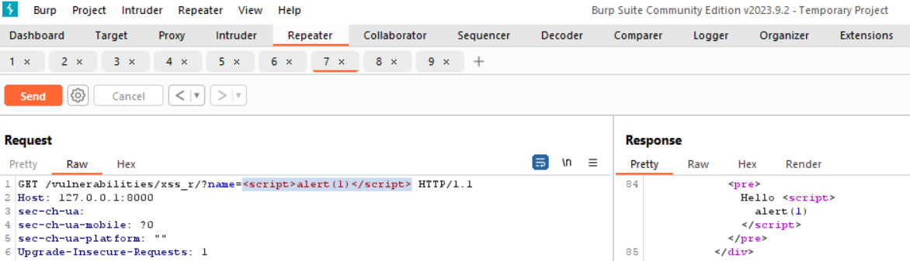

# Intro_Burpsuite  

## Objectifs :
✅ Démarrer et utiliser Burpsuite Community  

✅ Répondre aux questions demandées  

✅ Utiliser Docker  
  
## Répondre aux questions :
- ### Pour la partie "File Inclusion", faire une capture d'écran de la réponse HTTP avec le fichier /etc/passwd récupéré  
  

- ### Pour la partie "Command Injection", faire une capture d'écran de la réponse HTTP avec la commande id  
  
  Avec la réponse de la commande id (ligne 93) et le contenu de README.md :  

    

- ### Pour la partie "XSS (Reflected)", faire une capture d'écran de la réponse HTTP avec le script XSS affiché  
  
